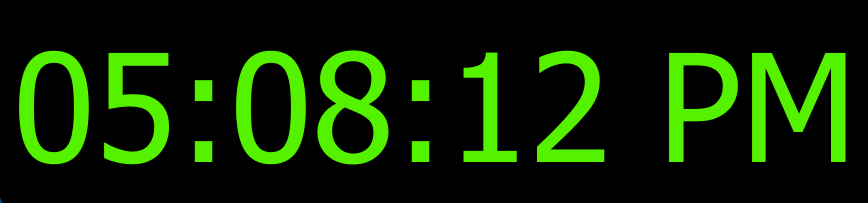

# 🕒 Digital Clock using PyQt5

A simple and elegant **Digital Clock** built with **Python** and **PyQt5**. The application displays the current system time in a large digital format and automatically updates every second using `QTimer`.

## 📸 Preview




---

## ✨ Features

- Real-time digital clock
- Updates automatically every second
- 12-hour time format with AM/PM
- Clean and minimal user interface
- Large digital font for better visibility
- Black background with bright green text

---

## 🛠️ Technologies Used

- Python 3
- PyQt5

---

## 📂 Project Structure

```
Digital-Clock/
│
├── digital_clock.py
├── README.md
└── images/
    └── digital_clock.png
```

---

## 🚀 Installation

### 1. Clone the repository

```bash
git clone https://github.com/your-username/Digital-Clock.git
```

### 2. Navigate to the project folder

```bash
cd Digital-Clock
```

### 3. Install dependencies

```bash
pip install PyQt5
```

or

```bash
pip install -r requirements.txt
```

---

## ▶️ Run the Project

```bash
python digital_clock.py
```

---

## ⚙️ How It Works

- Uses **QTimer** to trigger an update every **1000 milliseconds (1 second)**.
- Retrieves the current system time using **QTime.currentTime()**.
- Displays the time in **HH:MM:SS AM/PM** format.
- The QLabel is updated every second to show the latest time.

---

## 📚 Concepts Used

- PyQt5 Widgets
- QLabel
- QVBoxLayout
- QTimer
- QTime
- Signals & Slots
- Object-Oriented Programming (OOP)
- Electronics & Computer Engineering Student

If you like this project, don't forget to ⭐ the repository!
